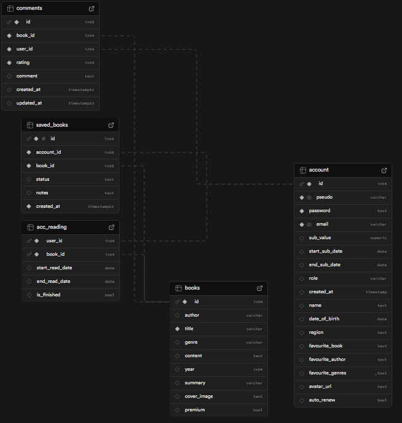
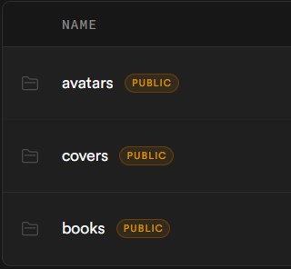

# AlexandRead Database (Supabase)

This doc captures the data model and storage used by the backend. Related docs: [README.md](./README.md) | [API.md](./API.md) | [Backend.md](./Backend.md) | [Frontend.md](./Frontend.md) | [Screenshots.md](./Screenshots.md)

## Schema Overview

We use the Supabase database (Postgre SQL database).

Key tables used by the app:
- `account` : users with auth info, profile fields (name, pseudo, region, favourite genres/authors), avatar URL, role, and subscription fields (`sub_value`, `start_sub_date`, `end_sub_date`, `auto_renew`).
- `books` : catalog of books with title, author, genre, year, summary, `cover_image`, `content` path/URL, and `premium` flag.
- `comments` : user feedback with `book_id`, `user_id`, `rating` (1:10), optional `comment`, and timestamps.
- `acc_reading` : reading activity per user/book with start/end dates and `is_finished` flag.
- `saved_books` : user library of saved titles (`account_id`, `book_id`).

## Storage Buckets

Configured Supabase storage buckets:
- `covers` : uploaded cover images (base64 uploads from admin console) used as `cover_image` paths/URLs.
- `books` : uploaded book content files (PDF) referenced by `content`.
- `avatars` : user avatar images uploaded from the account settings page.

## Notes
- Upload routes accept base64 data URLs and return both the bucket path and a public URL for direct use by the frontend.
- Subscriptions are represented directly on the `account` table; there is no separate subscription table.
