# Screenshots and Feature Walkthrough

Related docs: [README.md](./README.md) | [API.md](./API.md) | [Backend.md](./Backend.md) | [Frontend.md](./Frontend.md) | [Database.md](./Database.md)

## Home and Discovery
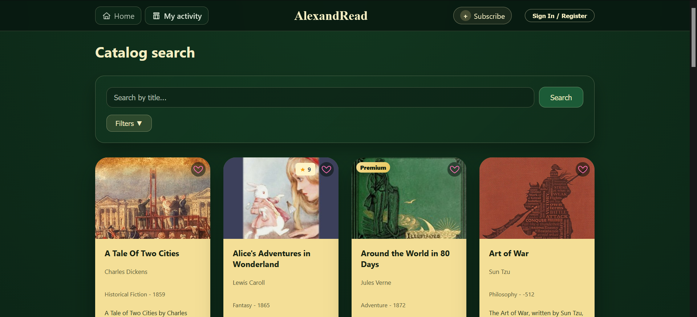  Home page with featured books and navigation into the catalog.
  Search results filtered by user queries (author, genre, year, subscription or not).

## Authentication
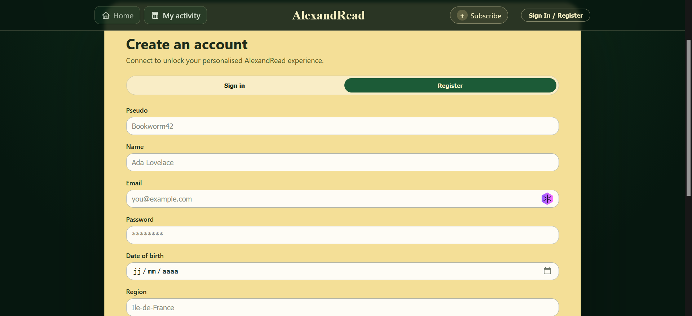  Account creation form with email, password, and profile basics.
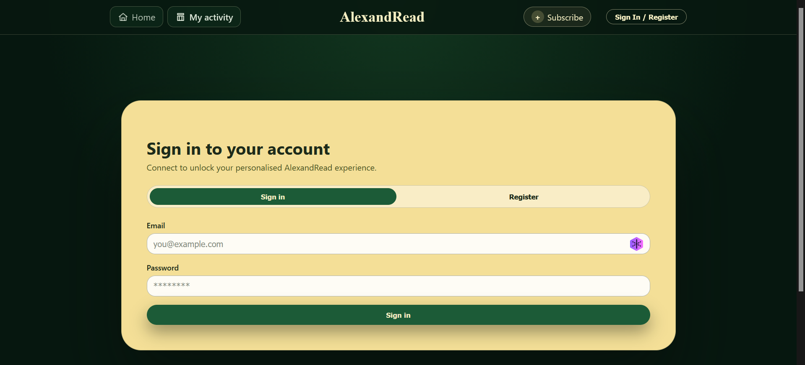  Login form to retrieve the session token.

## Account and Profile
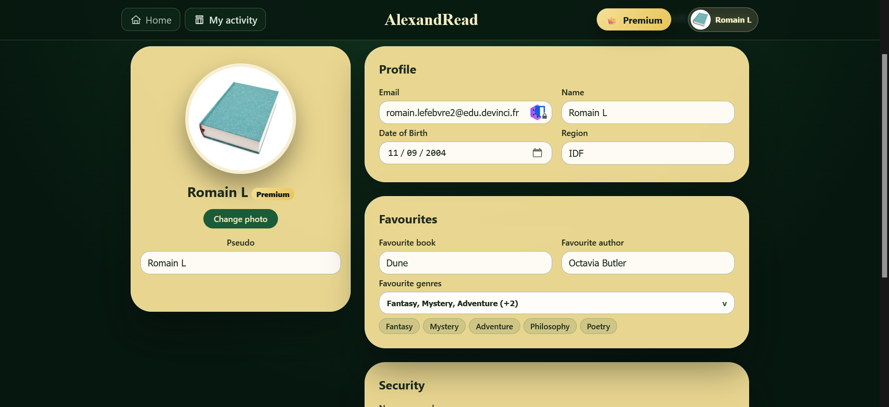  Profile overview with personal info and subscription status.

## Activity and Recommendations
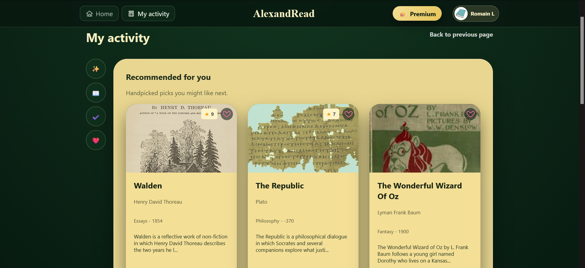  Personalized suggestions based on history and preferences.
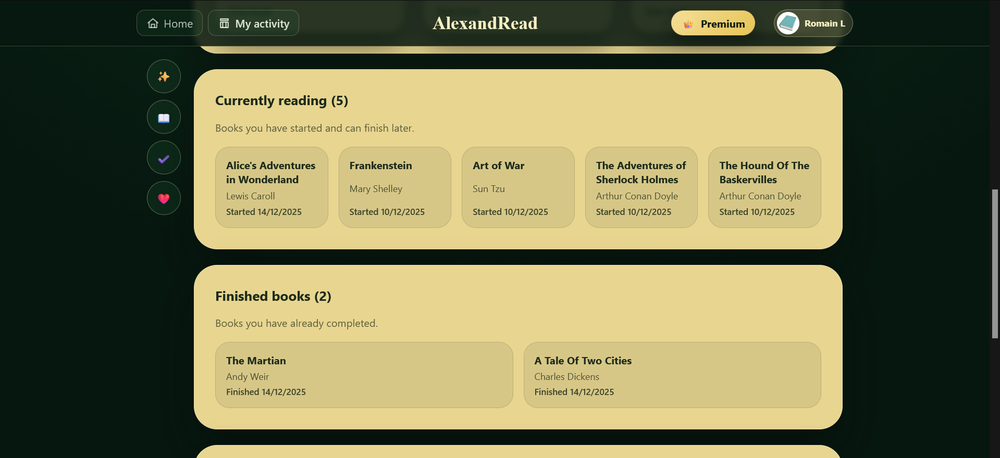  In-progress and completed reading entries.
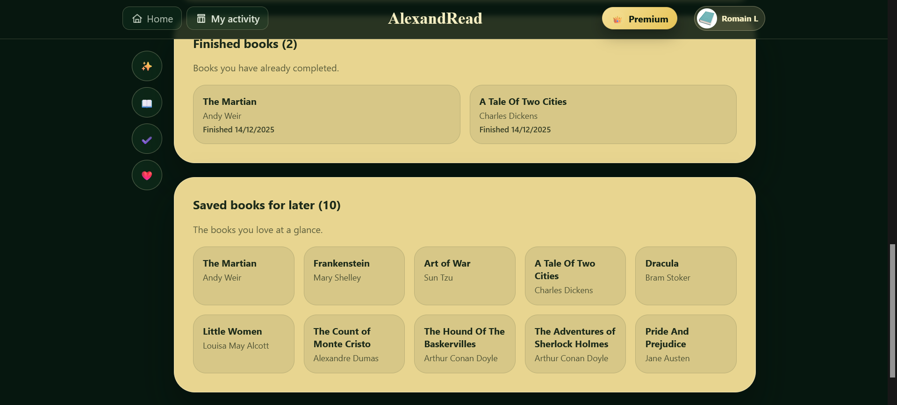  Users saved titles library.

## Book Details and Feedback
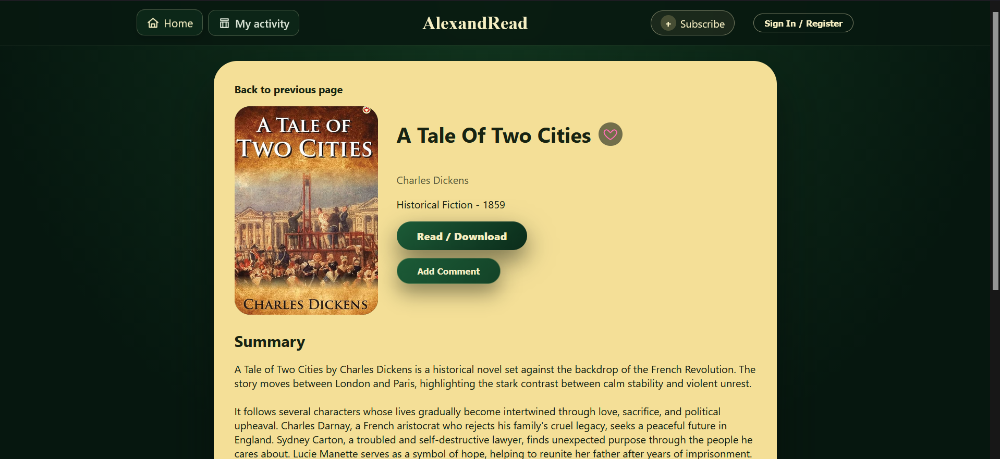  Book detail page with basic informations (title, author, summary, year, genre, rating), cover, and actions to read or save.
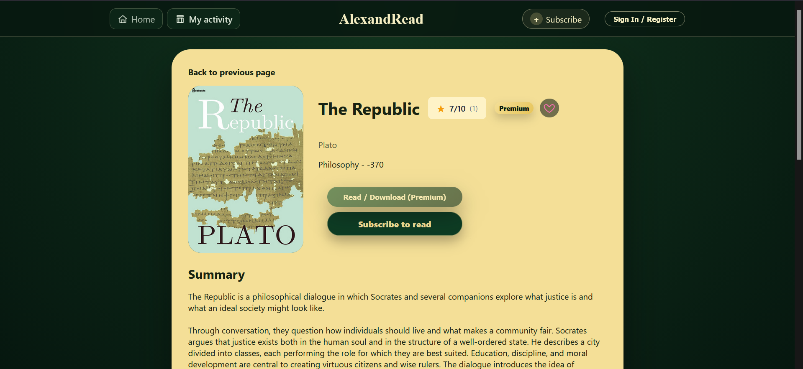  Premium-flagged book with subscription requirement.
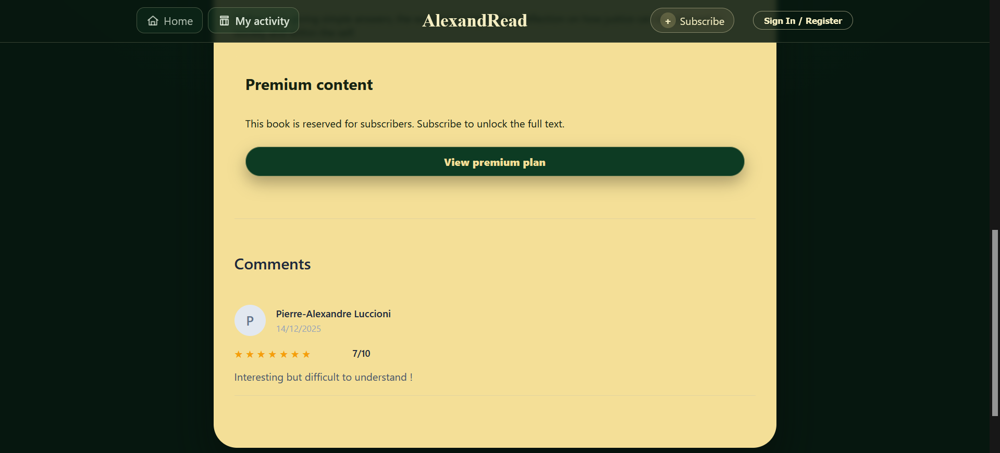  Existing ratings/comments by other users.
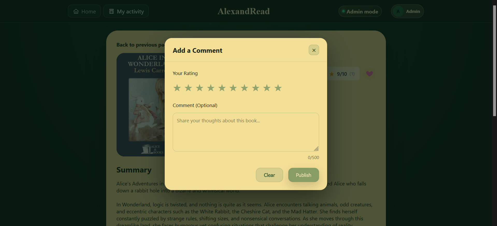  Form to submit a rating and optional comment.

## Subscription Flows
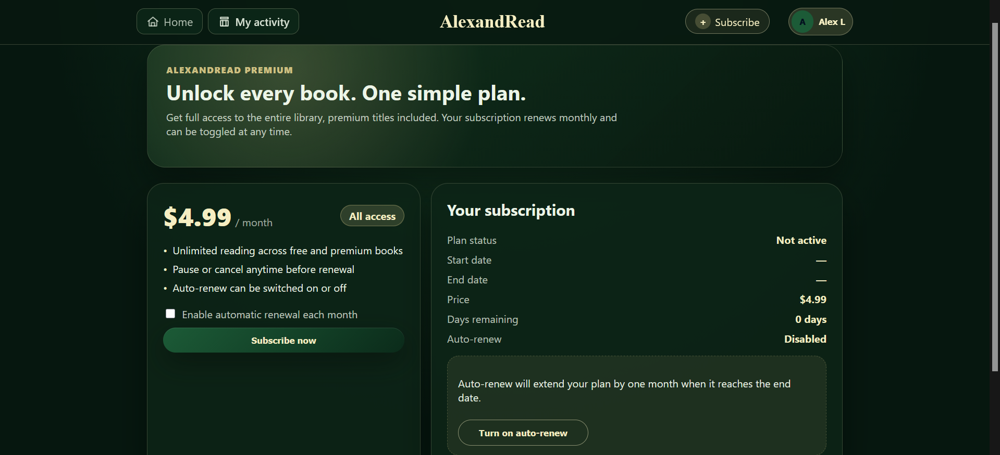  View of the account without an active subscription.
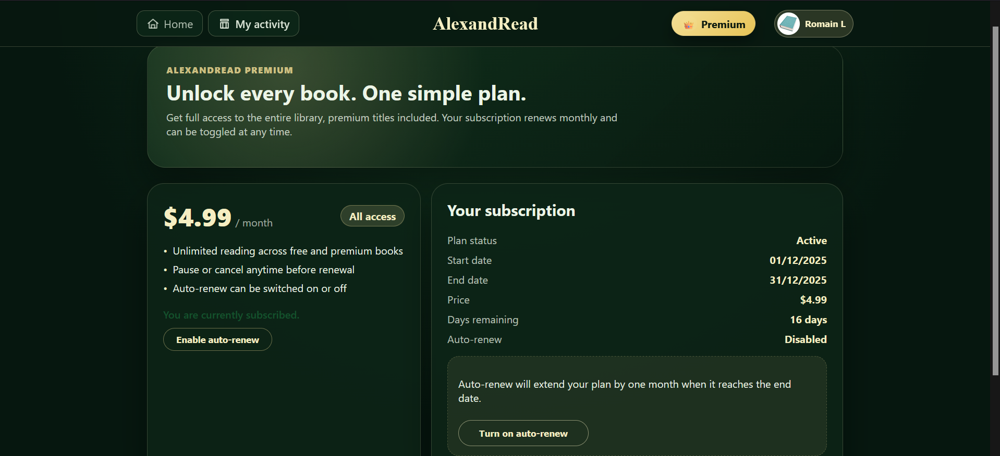  View with active subscription and remaining days/auto-renew toggle.

## Admin Console
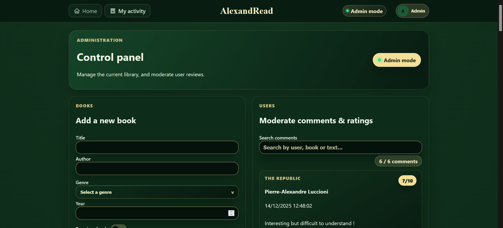  Entry dashboard for admins.
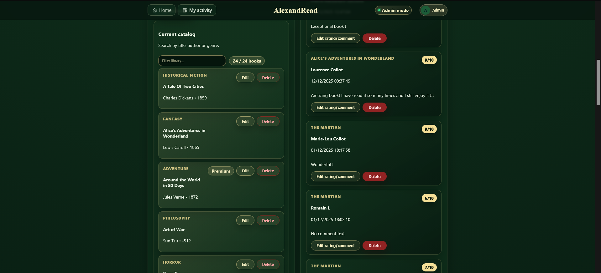  Searchable/filterable book list and ratings for admins.
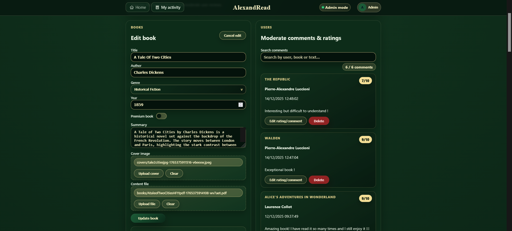  Editing interface for books.
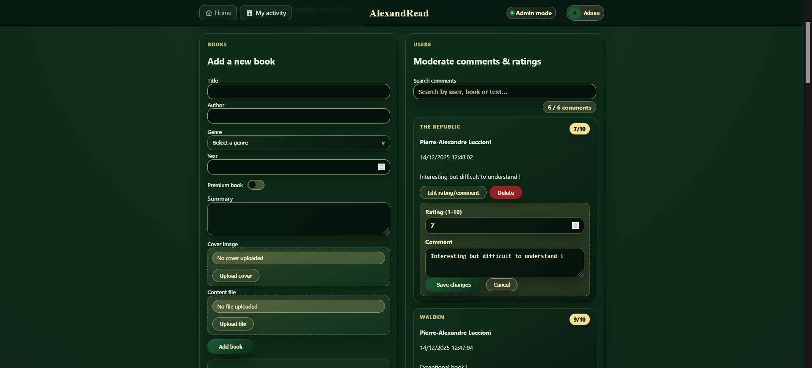  Combined flows for adding books and moderating comments.
